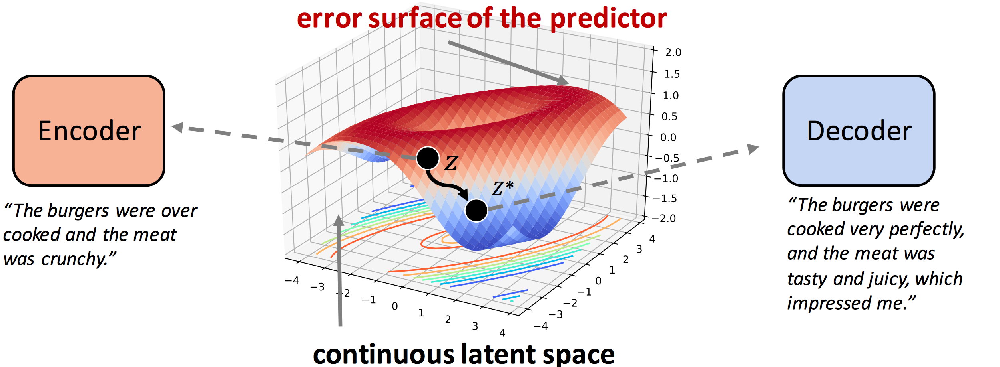

# Revision in Continuous Space: Fine-Grained Control of Text Style Transfer

This repo contains the code and data of the following paper:
>**Revision in Continuous Space: Fine-Grained Control of Text Style Transfer**, arXiv 2019

# Overall

 

We explore a novel task setting for text style transfer, in which it is required to simultaneously manipulate multiple fine-grained attributes. We propose to address it by revising the original sentences in a continuous space based on gradient-based optimization.

   
